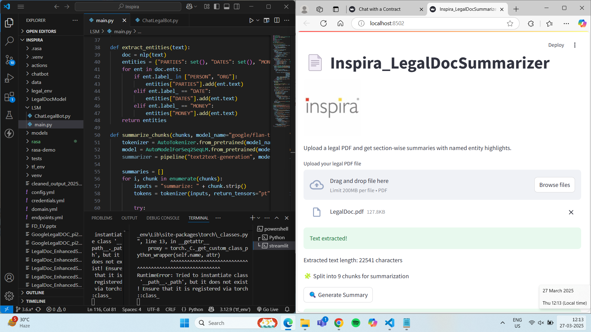
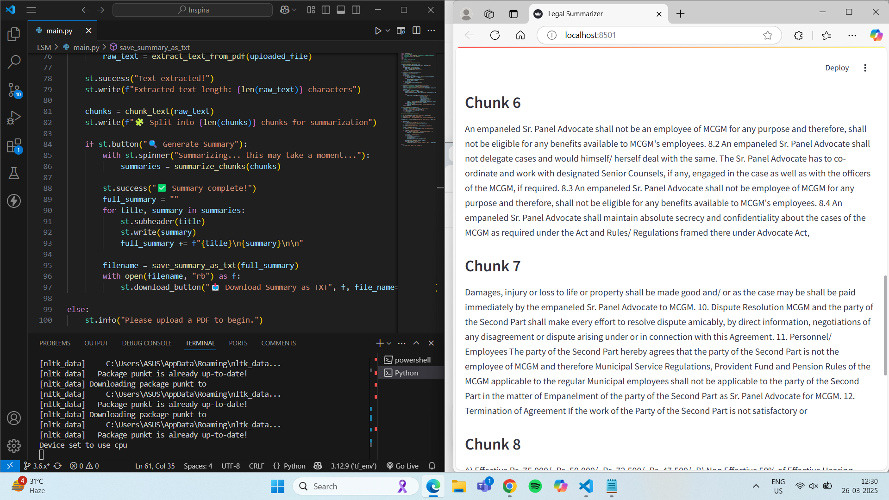
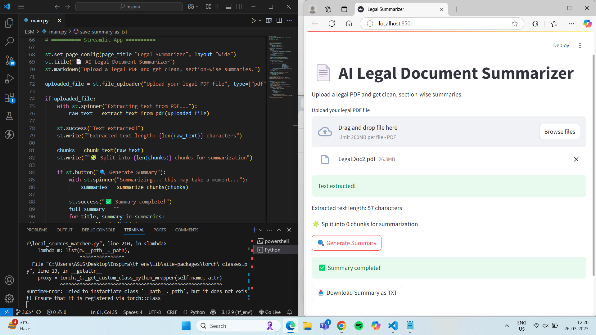

# 📄 Inspira_LegalDocSummarizer – `main.py`

This script powers the **Streamlit-based legal document summarizer** app. It extracts text from uploaded legal PDFs, generates chunk-based summaries using a transformer model, identifies key named entities (PARTIES, DATES, MONEY), and produces a downloadable summary PDF report.

---

## 🚀 What It Does

- Upload and read any legal PDF
- Automatically chunk the document for better summarization
- Run transformer-based summarization (`flan-t5-base`)
- Highlight named entities with `spaCy`
- Export a beautiful PDF with summaries + extracted entities

---

## 🧠 How It Works

### 1. **Text Extraction**
Uses `PyMuPDF` to extract plain text from all pages of a PDF.

### 2. **Chunking**
Uses `nltk` sentence tokenization to create 450-token chunks for summarization.

### 3. **Summarization**
Applies Hugging Face pipeline using `google/flan-t5-base`, with smart truncation.

### 4. **Entity Recognition**
Applies `spaCy`'s NER to extract:
- `PERSON`, `ORG` → **PARTIES**
- `DATE` → **DATES**
- `MONEY` → **MONEY**

### 5. **PDF Report Generation**
Generates styled output with `fpdf`:
- Includes logo (local JPEG)
- Uses `DejaVuSans.ttf` for Unicode support

---

## 📦 Dependencies

```bash
streamlit
PyMuPDF
nltk
transformers
fpdf
spacy
torch
sentencepiece
```

Also run:
```bash
python -m nltk.downloader punkt
python -m spacy download en_core_web_sm
```

---

## 📁 Required Files

Ensure the following files are in the same directory:
```
main.py
logo_inspira.jpeg
DejaVuSans.ttf
```

---

## ▶️ Run the App

```bash
streamlit run main.py
```
Then open the app in your browser and upload any legal PDF.

---

## 🧩 Sample Output

- Summary:
  > "This agreement is made between ABC Corp and XYZ Ltd..."
- Entities:
  - PARTIES: ABC Corp, XYZ Ltd
  - DATES: Jan 1, 2025
  - MONEY: $100,000

---
## 📸 Screenshots

### 🔹 App Launched & PDF Uploaded


### 🔹 Chunked Summaries Displayed


### 🔹 Summary Completed & Ready to Download

